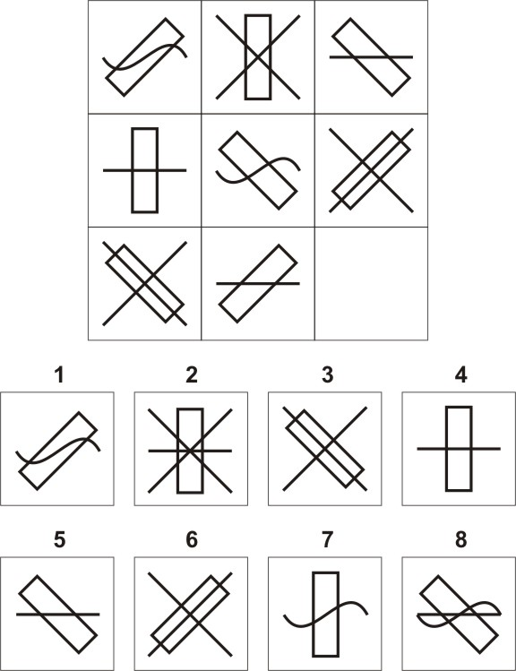
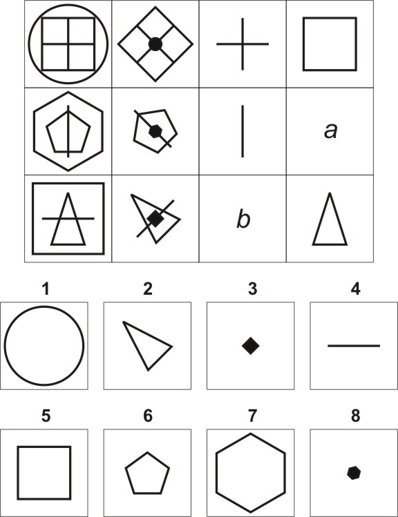

# RavenSolver

The Raven's Progressive Matrices Test (RPM) is a set of problems in which the participant has to select the option that best completes a visual pattern. The following image shows a problem that is similar to those found in the test:

The test attempts to measure the participant's ability to discover relations, and it is known as an intelligence quotient test. Although the validity of the test to "measure intelligence" is debated, in the field of artificial intelligence it represents an interesting task to test computational models of reasoning.

This repository contains a Java application that was developed as part of a Master's thesis and that attempts to solve the Standard RPM automatically, starting from a symbolic representation of the test and using a variety of optimization algorithms.

The program focused on modelling a rule induction process within the Standard RPM and it managed to solve 54 of the 60 problems, surpassing the score of previously published works. Moreover, the program was able to solve problems that are more general than those of the RPM, such as the problem shown in the following image:

This project required an analysis of the characteristics of the RPM, of the processes that are necessary for its resolution, and of the processes involved in intelligence.

The repository includes the final document of the thesis in Spanish ([thesis.pdf](thesis.pdf)), an executable JAR file (dist/RavenSolver.jar), a symbolic representation of the problem shown in the previous image (dist/problems.txt) and the output produced when the JAR file tries to solve that problem (dist/out.txt). Original RPM problems are not included due to copyright limitations.

Keywords: Raven's progressive matrices test, synthesis of geometrical concepts, inductive reasoning, visual analogy, cognitive simulation.
