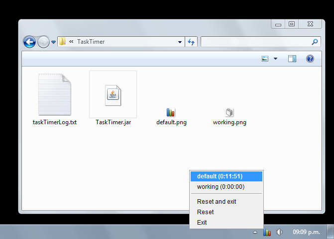

# TaskTimer
A simple Java application that lets you record how you spend your time.

Just place any image files in the same folder as TaskTimer.jar, and they will be listed in the task bar when you run the application. Then click an element in the list to activate its timer and pause all the others.

The file taskTimerLog.txt will be created automatically in the same folder. It will be used to save the state of all timers and will be updated every 10 minutes.
